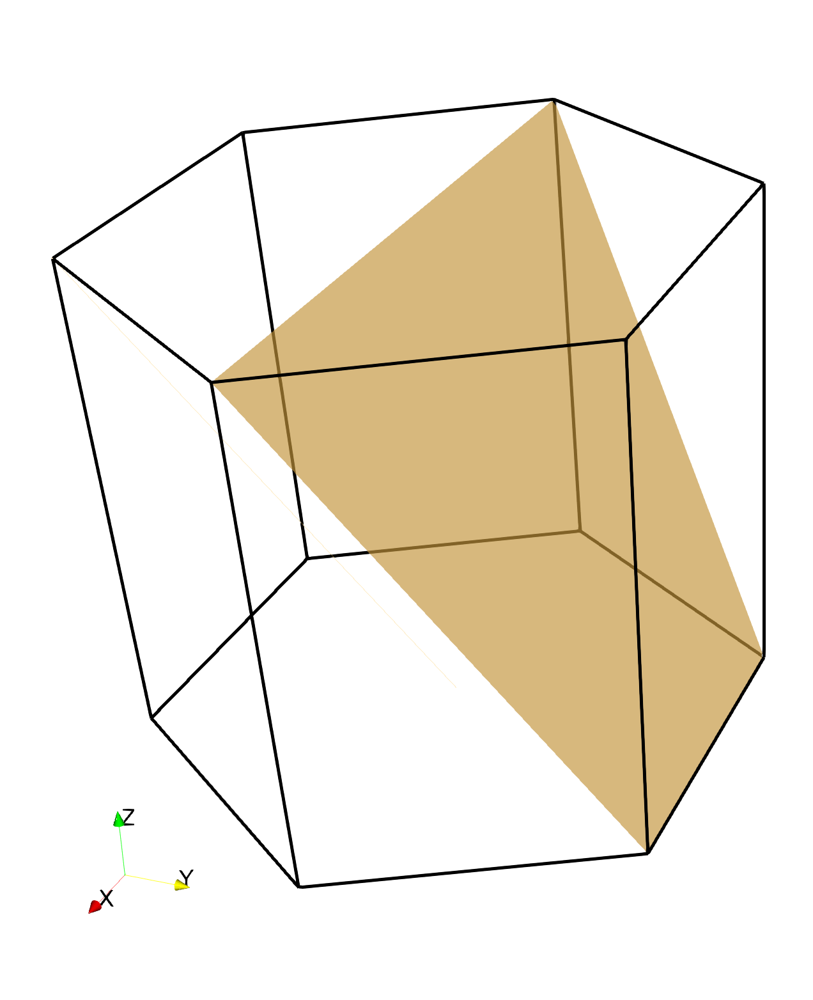

# vtk-unitcell
Generate crystallographic lattice unit cells to be visualized with VTK.



```
usage: vtk_unitcell.py [-h]
                       [--quaternion q p1 p2 p3 | --axisangle a1 a2 a3 angle | --euler phi1 Phi phi2]
                       [--family {cubic,tetragonal,hexagonal}]
                       [--lattice {p,i,f,hcp}] [--slipsystems SLIPSYSTEMS]
                       [--plane] [--direction] [--no-unitcell]
                       [--position x y z] [--scaling SCALING] [-a A] [-b B]
                       [-c C] [--alpha ALPHA] [--beta BETA] [--gamma GAMMA]
                       [--degrees]

VTK model of oriented unitcell

optional arguments:
  -h, --help            show this help message and exit
  --quaternion q p1 p2 p3
                        orientation as unit quaternion
  --axisangle a1 a2 a3 angle
                        orientation as axis and angle
  --euler phi1 Phi phi2
                        orientation as z-x-z Euler angles
  --family {cubic,tetragonal,hexagonal}
                        crystal symmetry
  --lattice {p,i,f,hcp}
                        lattice type
  --slipsystems SLIPSYSTEMS
                        list of slip systems to include
  --plane               plot slip planes
  --direction           plot slip directions
  --no-unitcell         omit unitcell
  --position x y z      coordinates of unitcell center
  --scaling SCALING     scale factor for unitcell coordinates
  -a A                  unit cell a
  -b B                  unit cell b
  -c C                  unit cell c
  --alpha ALPHA         unit cell alpha
  --beta BETA           unit cell beta
  --gamma GAMMA         unit cell gamma
  --degrees             angles are given in degrees

```
